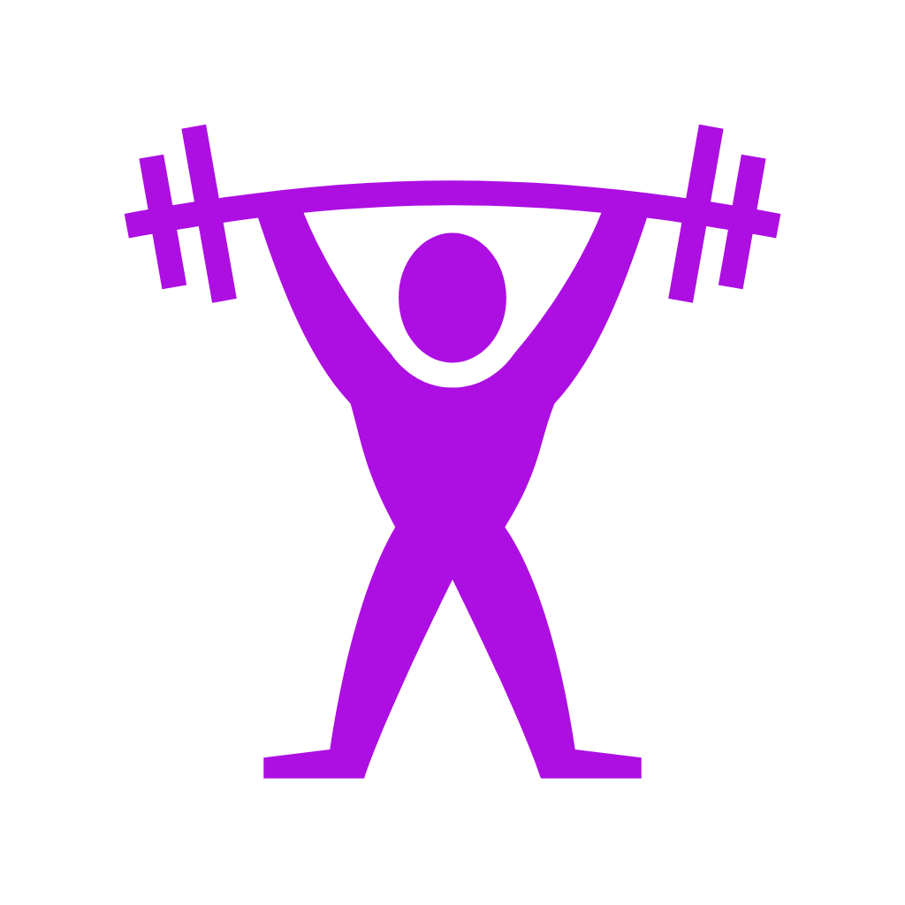
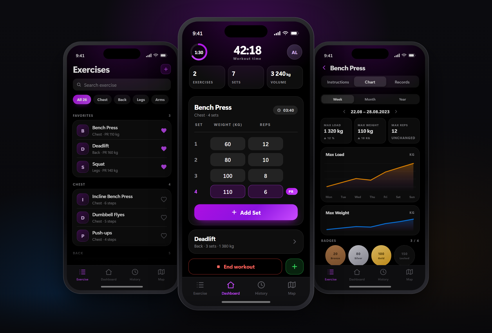
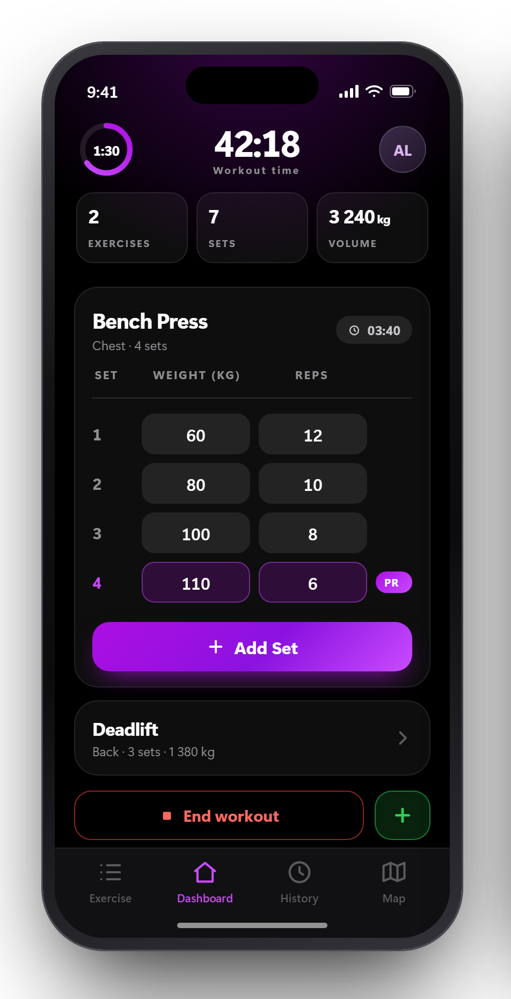
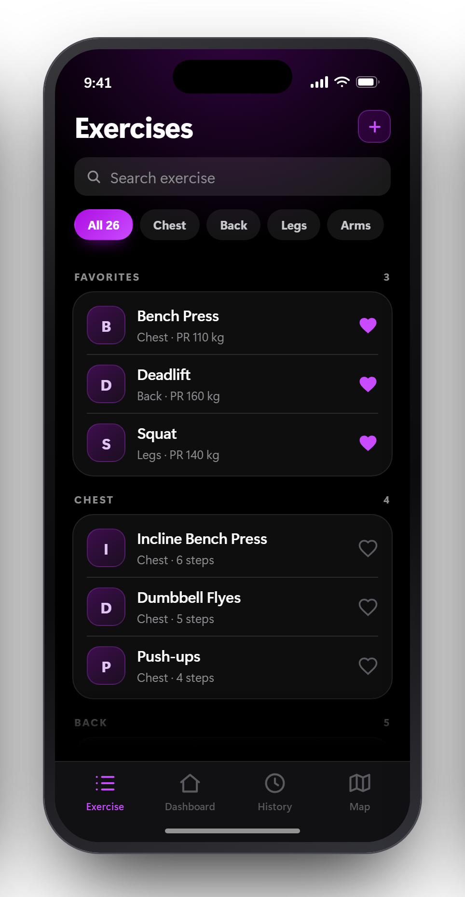
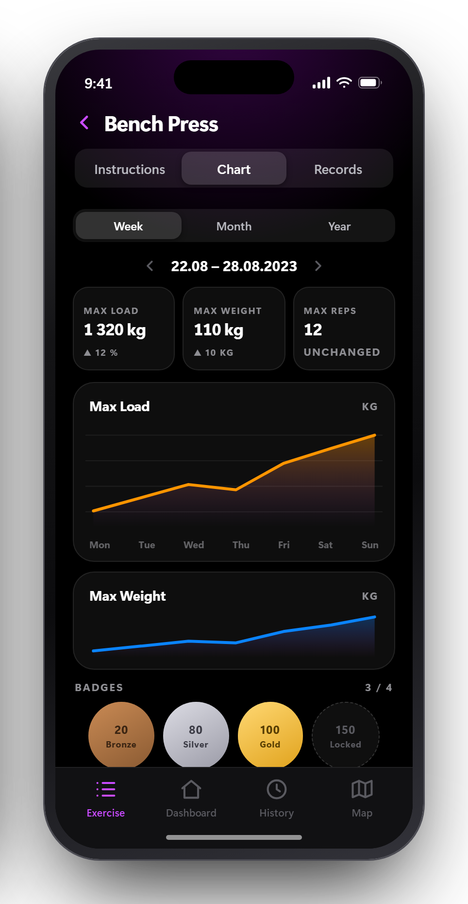
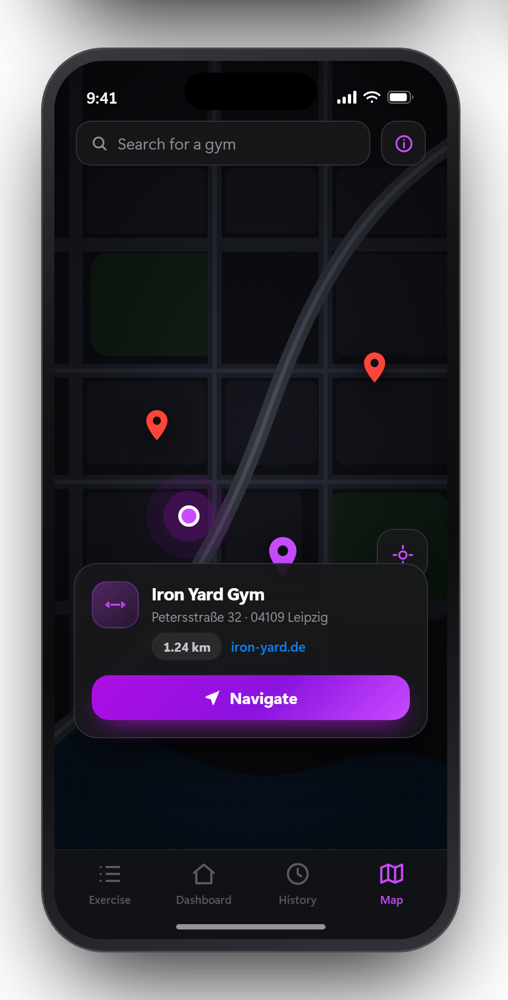

<div align="center">



# Benchy

**Log every set. Watch every PR.**
An offline-first workout tracker for iOS and Android — built with Flutter.

[](https://flutter.dev)
[](https://dart.dev)
[](https://pub.dev/packages/sqflite)
[](#)
[](LICENSE)



</div>

## Features

| | |
|---|---|
| **Live workout logging** | Start a session, add exercises, log weight and reps set by set. A stopwatch runs per workout, a timer per exercise, plus a configurable rest timer. |
| **Personal records** | Max, min and average for weight, reps, load and duration — new PRs are flagged automatically and unlock badges. |
| **Progress charts** | Load, weight, reps and duration plotted by week, month or year. |
| **Nearby gyms** | Gyms around you on a map, with distance, address, website and one-tap navigation. |

> Everything is stored locally in SQLite — no account, no sync, no tracking. Works fully offline (the gym map needs a connection).

Planned: reusable workout templates.

## Screenshots

| Workout | Exercises |
|:--:|:--:|
|  |  |
| **Progress** | **Gyms** |
|  |  |

<sub>Design mockups of the current build.</sub>

## Quick start

```bash
git clone https://github.com/leuteritz/GymTracker.git
cd GymTracker
flutter pub get
flutter run
```

Requires the [Flutter SDK](https://flutter.dev/docs/get-started/install) (Dart >= 3.0.6).

## Tech stack

| Layer | Used |
|---|---|
| UI | Flutter · Cupertino widgets, dark theme |
| Storage | `sqflite` — local SQLite database |
| Charts | `fl_chart` |
| Maps | `flutter_map` · OpenStreetMap tiles · Overpass API |
| Location | `geolocator` · `url_launcher` |

## Project structure

```
lib/
├── main.dart          App entry and Cupertino theme
├── screens/           Exercise · Dashboard · History · Map tabs
├── pages/             Detail and picker pages
├── widgets/           Reusable UI per screen
├── charts/            fl_chart wrappers (load, weight, reps, duration)
├── map/               Gym markers and popups
└── data/              SQLite schema and seed exercises
```

## License

MIT — see [LICENSE](LICENSE).
